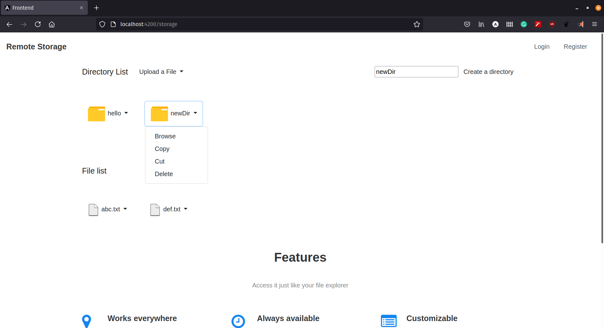
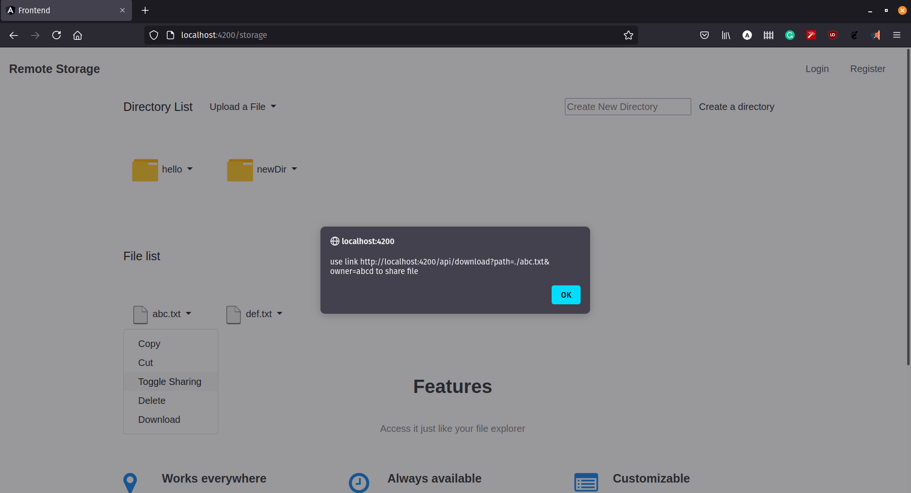

# Backend of remote storage application developed using node.js

Horizontally scalable remote storage application. 
Files are stored in GridFS https://docs.mongodb.com/manual/core/gridfs/ .  
Support for HadoopDFS will be added soon.  

# Features:

File sharing as per preference 
Cut, copy, paste files or directories 
Create directories 
Delete files or directories 
Upload multiple files 
Download your files 
Login / Register 

# Previews:

 

